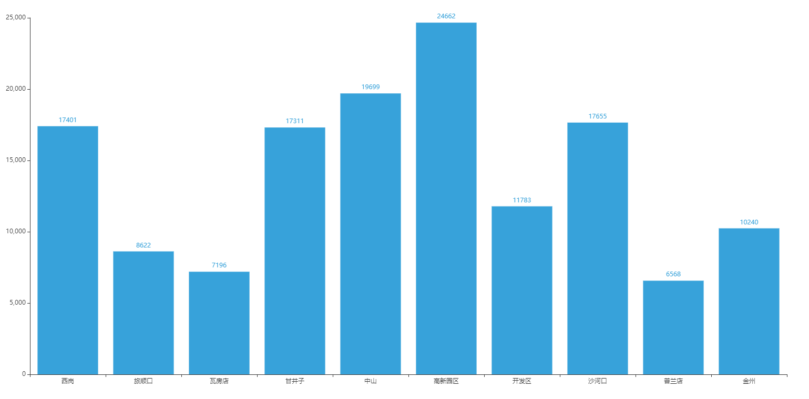

# 开源软件基础课程作业

#### 1. 小组成员

​		李东-201992388

​		翟海涛-201992354

​		冯满-201992417

​		王惟楚-201792354

​		张志祥-201992022

#### 2. 文件介绍

​		index.html：数据分析结果网页

​		images：网页链接图片

​		SparkWithMongo：数据分析程序

#### 3.  运行环境

python: 3.9.6

mongodb: 5.0.4

IDEA: 2021.2

Maven: 3.6.3

dependencies：

mongo-spark-connector: 2.12

spark-core: 2.12

spark-sql: 2.12

#### 4. 使用方法

直接打开index.html

#### 5. 例图

​		

